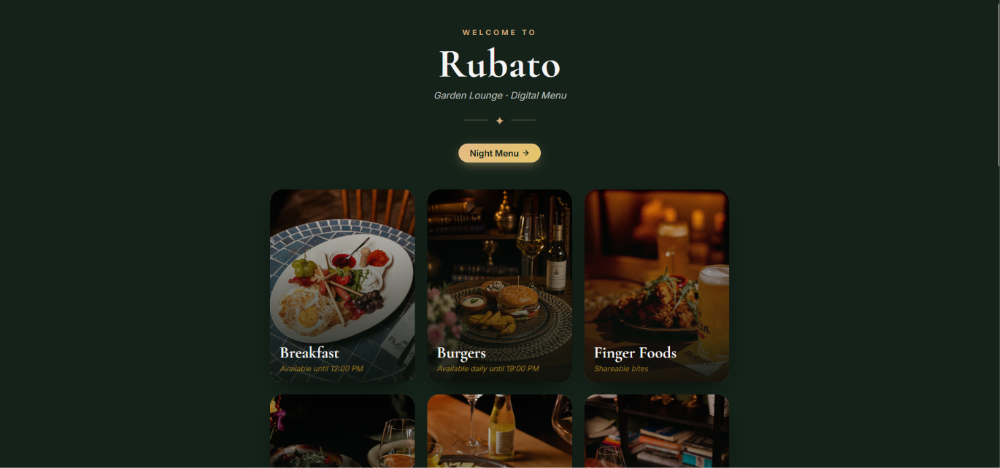
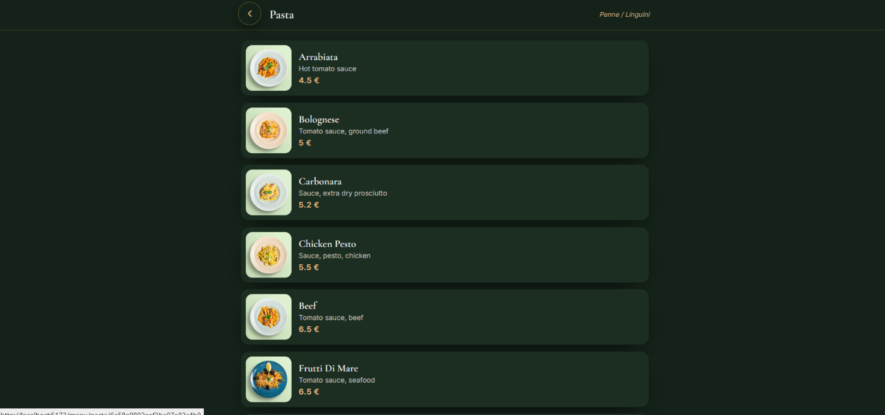
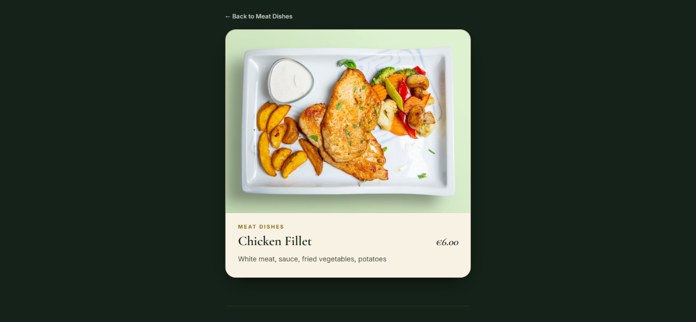
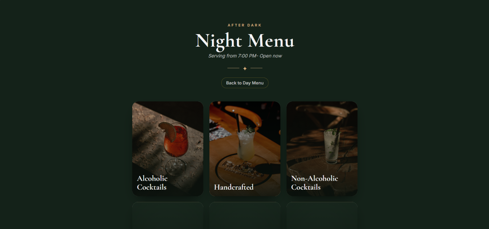
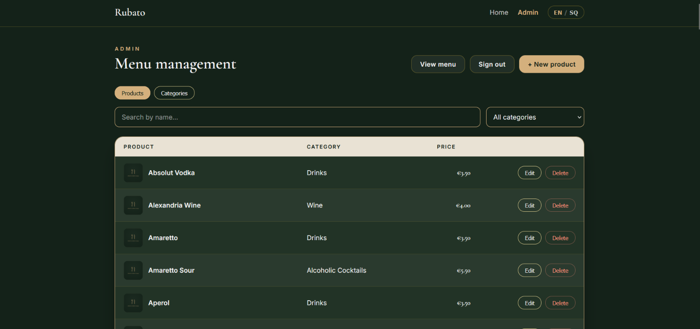
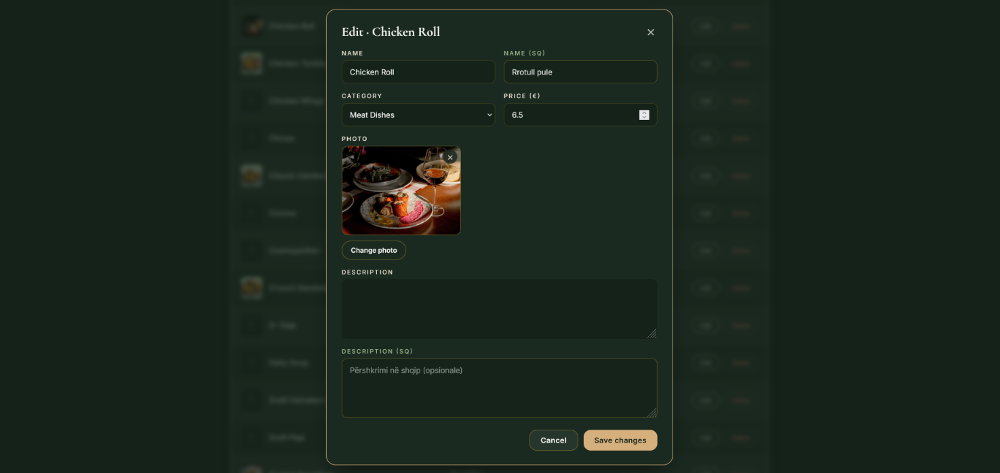

# Rubato Garden Lounge
 
A full-stack digital menu for Rubato Garden Lounge, built with the MERN stack. What started as a simple request to put the menu online grew into a full client project — complete with an admin dashboard, image uploads, and caching.
 
There are two sides to it:
- **Public menu** — what customers actually see (categories, items, a night menu, EN/SQ language toggle)
- **Admin dashboard** — where the restaurant staff manage products and categories, protected behind login
## Screenshots
  
**Home page**
 

 
**Category / menu list**
 

 
**Item detail**
 

 
**Night menu**
 

 
**Admin dashboard**
 

 
**Admin — editing a product**
 

 
## Features
 
- Bilingual content (English / Albanian) with a language toggle that persists in localStorage
- Separate "Night Menu" section with its own categories, and an "open now" badge that flips on after 7pm
- Admin dashboard (JWT-protected) for creating/editing/deleting products and categories, with search + filtering
- Image uploads go straight to Cloudflare R2 via presigned URLs, with file-signature checks so people can't just rename a random file and upload it as an image
- Server-side caching (node-cache) on the public menu endpoints so the DB isn't getting hit on every page load
- Rate limiting split by route type — login, admin reads, admin writes, and uploads all have their own limits
- SEO basics: per-page meta tags, JSON-LD structured data, a dynamic sitemap, and a bot-detection layer that serves lightweight HTML to social media crawlers so link previews actually work
- Confirm modals instead of the browser's native confirm() popups
- CI on GitHub Actions — lint + test + build run on every push/PR for both frontend and backend
## Tech stack
 
**Frontend:** React, Vite, React Router, react-helmet-async
**Backend:** Node, Express 5, Mongoose (MongoDB)
**Storage:** Cloudflare R2 for images
**Testing:** Vitest + React Testing Library (frontend), Jest + Supertest + mongodb-memory-server (backend)
**Other:** Pino for logging, Joi for validation, PM2 + Nginx for deployment
 
 
## Running it locally
 
Clone the repo and install deps in both folders:
 
```bash
cd backend && npm install
cd ../frontend && npm install
```
 
You'll need a `.env` file in `backend/` with something like:
 
```
PORT=8080
DB_URL=your-mongodb-connection-string

ADMIN_EMAIL=admin@email.com
ADMIN_PASSWORD=adminpassword
ADMIN_NAME=Admin

JWTPRIVATEKEY=long-random-secret

R2_ACCOUNT_ID=...
R2_ACCESS_KEY_ID=...
R2_SECRET_ACCESS_KEY=...
R2_BUCKET_NAME=...
R2_PUBLIC_URL=...

```
 
Seed the database (categories → products → an admin user):
 
```bash
npm run seed:categories
npm run seed:products
npm run seed:admin
```
 
Then run both servers:
 
```bash
# backend
npm run dev
 
# frontend, separate terminal
npm run dev
```
 
Frontend runs on Vite's dev server and proxies `/api` requests to the backend on port 8080.
 
## Tests
 
```bash
# backend
npm test
 
# frontend
npm test
```
 
Built as a freelance/client project for Rubato Garden Lounge. 
